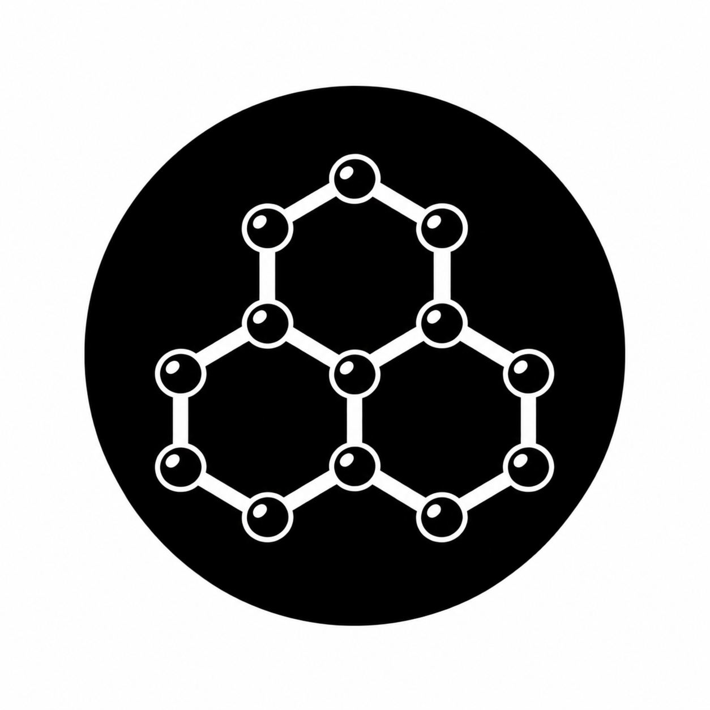

<p align="center">
  
</p>

<h1 align="center">GRAFITE</h1>

<p align="center">
  <strong>General-purpose Real-time Audio Framework</strong>
</p>

<p align="center">
  A modular and extensible C++ engine for real-time and offline audio/DSP
  processing.
</p>

<p align="center">
  <!-- Additional badges can be added here as project infrastructure becomes active. -->
  <a href="LICENSE">
    
  </a>
</p>

---

## Overview

**GRAFITE** is a general-purpose audio processing engine designed as a
foundation for building modular, reusable, and interoperable audio
applications and DSP components.

Rather than targeting a single application type, GRAFITE provides a common
processing architecture that can support effects processors, synthesizers,
mixers, loopers, sequencers, analysis tools, and other audio systems. Simple
DSP units and complete processing subsystems can be composed using the same
graph model.

The engine is designed around a platform-independent C++ processing core,
with external audio I/O isolated behind dedicated backends. Linux is the
initial development target, while portability to other platforms remains a
fundamental architectural requirement.

Real-time and offline processing share the same nodes, graphs, buffers, and
event model. Audio and discrete events are represented as separate streams
and synchronized on a common sample timeline.

> [!IMPORTANT]
> GRAFITE is currently in the initial architecture and development phase.
> The public API and internal interfaces described below are design goals and
> may evolve substantially before the first stable release.

## Key features and design goals

- Modular graph-based DSP architecture built around **Node**, **Port**,
  **Graph**, and **Engine** abstractions.
- Hierarchical composition through **subgraphs and composite nodes**.
- Reusable components ranging from individual DSP operations to complete
  application subsystems.
- Common processing model for **real-time and offline** execution.
- **Sample-accurate event scheduling** within audio processing blocks.
- Separation of continuous audio streams from MIDI, automation, transport,
  and other discrete events.
- Platform-independent processing core with interchangeable audio I/O
  backends.
- Real-time-oriented execution model with a clear separation between control
  and audio processing domains.
- C++ DSP core with future Python bindings focused on composition,
  configuration, scripting, and control.
- Architecture intended to let independently developed GRAFITE components
  and applications interoperate inside larger processing graphs.

## Contents

- [Design philosophy](#design-philosophy)
- [Audio and event processing](#audio-and-event-processing)
- [Processing model](#processing-model)
- [Core components](#core-components)
- [Composite nodes and subgraphs](#composite-nodes-and-subgraphs)
- [Planned DSP library](#planned-dsp-library)
- [Python integration](#python-integration)
- [Repository structure](#repository-structure)
- [Getting started](#getting-started)
- [Build system](#build-system)
- [Development roadmap](#development-roadmap)
- [Non-goals of the core](#non-goals-of-the-core)
- [Contributing](#contributing)
- [License](#license)

## Design philosophy

GRAFITE is built around a small set of architectural principles.

### Modular by design

Audio processing is represented as a graph of independent processing
components. A component may be a simple DSP operation, such as a gain stage
or filter, or a more complex processing subsystem.

The fundamental abstractions are:

- **Node** — an individual processing unit;
- **Port** — an input or output endpoint of a node;
- **Graph** — the network describing nodes and their connections;
- **Engine** — the execution environment responsible for processing the graph.

The intention is to keep these abstractions sufficiently general that the
same engine can support effects processors, synthesizers, mixers, loopers,
sequencers, analysis tools, and other audio applications.

### Reusable and interoperable applications

GRAFITE is designed so that modularity does not stop at individual DSP
components.

A complete processing graph can be encapsulated as a composite node or
subgraph. This allows a complex component, or potentially an entire
application, to expose a simple set of ports and be reused inside a larger
graph.

Conceptually:

```text
Input -> [ Pedalboard ] -> [ Looper ] -> [ Mixer ] -> Output
              |                |             |
           subgraph          subgraph       subgraph
```

A pedalboard, synthesizer, looper, mixer, or other application can therefore
be designed both as a standalone program and as a component that can
interoperate with other GRAFITE-based systems.

### Platform-independent processing core

The DSP core must not depend on a particular operating system or audio API.

Platform-specific audio I/O is isolated behind backend interfaces. Linux is
the initial development target, with ALSA and JACK planned as the first
real-time backends. Other systems can be supported later without changing
the processing model.

Potential future backends include CoreAudio, WASAPI, ASIO, PipeWire, network
audio, and other I/O mechanisms.

The core itself must never require platform-specific APIs such as ALSA or
JACK.

### Real-time and offline processing

The same nodes and processing graphs are intended to operate both in
real-time and offline.

A DSP node should not need to know whether its input originates from an audio
device, a file, a generated buffer, or another source. Likewise, its output
may eventually be sent to hardware, stored in a file, passed to another
application, or inspected by a test environment.

Conceptually:

```text
                  +----------------+
                  |     Graph      |
                  +-------+--------+
                          |
                 +--------+--------+
                 |                 |
             Real-time           Offline
                 |                 |
           audio backend      file / buffer
```

This separation also makes it possible to test DSP components independently
of physical audio hardware.

### Real-time-safe architecture

The real-time processing path is designed around predictable execution.

Operations such as dynamic memory allocation, blocking synchronization, file
I/O, logging, and other potentially unbounded operations should not occur in
the real-time processing thread.

GRAFITE therefore distinguishes between two execution domains:

```text
Control / non-real-time             Audio / real-time
-----------------------             -----------------

create nodes                         process blocks
configure graph                     process audio
connect ports                       process events
allocate resources
load external data
prepare state
```

Configuration and structural changes are prepared outside the audio thread
and made available to the real-time engine through mechanisms that preserve
deterministic processing.

The exact synchronization and graph-update mechanisms will be developed as
the engine architecture matures.

## Audio and event processing

GRAFITE treats continuous audio data and discrete events as separate types of
streams.

Audio is processed in blocks, while events carry timing information relative
to those blocks. This permits sample-accurate event scheduling.

For example:

```text
frame      0                                      255
           |----------------------------------------|
audio      ==========================================
events          ^             ^                 ^
               31            142               231
```

Events may eventually represent:

- MIDI messages;
- parameter changes and automation;
- transport information;
- triggers;
- control messages;
- application-specific events.

Audio and event streams remain distinct but share the same processing clock
and timeline.

## Processing model

At the center of the processing API is a processing context associated with
each block.

A `ProcessContext` is expected to provide the information required by a node
to process the current block, including concepts such as:

- audio buffers;
- event buffers;
- number of frames;
- sample rate;
- absolute frame position;
- timing and transport state.

Nodes operate exclusively on this processing representation and do not
directly interact with hardware APIs.

This creates a processing chain conceptually similar to:

```text
Backend / source
      |
      v
+-------------+
|   Engine    |
+------+------+
       |
       v
+-------------+
|    Graph    |
+------+------+
       |
       +----> Node ----> Node ----> Node
                              |
                              +----> ...
```

## Core components

The initial architecture is organized around the following components.

### AudioBuffer

`AudioBuffer` represents blocks of audio samples used by the DSP engine.

Its design will account for channel organization, sample representation,
memory ownership and non-owning views, and the requirements of real-time
processing.

The internal DSP representation is intentionally separated from the sample
format used by external audio devices.

### Port

Ports represent node inputs and outputs.

GRAFITE will support at least two logical stream domains:

- audio ports;
- event ports.

Ports define how nodes are connected without exposing the implementation of
the underlying audio backend.

### Node

A `Node` is the fundamental processing unit.

Nodes may implement simple operations such as gain or filtering, generators
such as oscillators, routing operations such as mixing, event processing, or
complex subsystems.

Nodes are expected to follow a lifecycle broadly based on preparation,
processing, and reset operations.

### Graph

A `Graph` describes the processing topology.

It is responsible for representing nodes and their connections and for
providing the information required to determine a valid processing order.

Graph construction and modification belong to the non-real-time control
domain.

### Engine

The `Engine` coordinates execution of a graph.

Its responsibilities include processing blocks, coordinating timing and
scheduling, and interfacing the platform-independent processing model with
external I/O mechanisms.

The exact boundary between the engine, graph scheduler, and backend
implementations will be refined during development.

### Events

Events are timestamped relative to the audio processing timeline and can
occur at arbitrary sample offsets inside a processing block.

MIDI will be one supported event type rather than a special case embedded in
the audio architecture.

### Backends

Backends connect GRAFITE to external audio systems.

The backend layer is intentionally separated from the core so that different
platforms and execution environments can use the same processing graph.

The first development target is Linux, with ALSA and JACK support planned.

## Composite nodes and subgraphs

Hierarchical composition is a central design goal.

A graph should be able to expose selected inputs and outputs and behave as a
single node inside another graph:

```text
                 Composite Node
        +-----------------------------+
audio ->|  Node -> Node -> Node       |-> audio
event ->|      \-> Node ->/          |-> event
        +-----------------------------+
```

This enables reusable processing modules at multiple scales, from individual
effects to complete application subsystems.

Hierarchical graphs also provide a natural foundation for future
configuration, serialization, graphical editors, and application-level
composition.

## Planned DSP library

GRAFITE will include a collection of standard reusable DSP nodes. Initial
components will remain deliberately small while the core architecture is
validated.

Early nodes are expected to include basic components such as:

- gain;
- mixing;
- pass-through and routing utilities.

The DSP library can later grow into areas such as filtering, dynamics,
delays, modulation, synthesis, analysis, and other processing categories
without changing the fundamental graph model.

## Python integration

The real-time engine and DSP path are implemented in C++.

Python bindings are planned for higher-level tasks such as:

- graph construction;
- configuration;
- scripting;
- interactive experimentation;
- application control;
- offline workflows.

Python is not intended to execute sample-level DSP operations in the
real-time processing path.

A future workflow may therefore look conceptually like:

```text
Python
   |
   | configuration and control
   v
C++ Graph / Engine
   |
   | real-time processing
   v
C++ DSP
```

## Repository structure

The initial repository organization is:

```text
grafite/
├── cmake/
│
├── include/
│   └── grafite/
│       ├── core/
│       ├── event/
│       ├── backend/
│       └── dsp/
│
├── src/
│   ├── core/
│   ├── event/
│   ├── backend/
│   │   ├── alsa/
│   │   ├── jack/
│   │   └── file/
│   └── dsp/
│
├── tests/
│   ├── core/
│   ├── event/
│   ├── dsp/
│   └── backend/
│
├── examples/
│   ├── passthrough/
│   ├── simple_gain/
│   └── graph_demo/
│
├── apps/
├── bindings/
│   └── python/
│
└── docs/
```

Public C++ interfaces live under `include/grafite/`, while implementation
details remain under `src/`.

Platform-specific code must remain isolated from the platform-independent
core.

## Getting started

GRAFITE is not yet at a stage where a stable build or installation procedure
is provided. During the initial development phase, the repository primarily
defines the architecture, public interfaces, tests, and reference
implementations.

Once the first functional core is available, this section will provide the
standard workflow for cloning, configuring, building, testing, and installing
GRAFITE.

## Build system

GRAFITE uses CMake.

The project is intended to be organized into independent targets rather than
as a single monolithic library. The planned separation includes the core,
DSP components, and optional platform backends.

Conceptually:

```text
grafite_core
    ^
    |
grafite_dsp

grafite_core <--- grafite_backend_alsa ---> ALSA
grafite_core <--- grafite_backend_jack ---> JACK
```

Optional functionality should be independently selectable so that the core
can be built without requiring every supported backend or language binding.

Build instructions will be added once the first functional implementation is
available.

## Development roadmap

The initial development effort focuses on validating the architecture before
expanding the DSP library or application layer.

The first design and implementation stages are expected to cover:

1. fundamental types and sample representation;
2. audio buffer and memory model;
3. ports and node lifecycle;
4. processing context;
5. event representation and sample-accurate event buffers;
6. graph construction and validation;
7. graph scheduling;
8. engine execution model;
9. offline processing;
10. first Linux real-time backend;
11. basic DSP nodes and reference examples.

Higher-level applications, Python bindings, graphical interfaces, plugin
systems, and larger DSP collections will follow only after the core
processing model is sufficiently stable.

## Non-goals of the core

GRAFITE is not intended to hard-code the architecture of a particular audio
application.

The core should therefore not assume that it is running a pedalboard,
synthesizer, DAW, mixer, sequencer, or looper. These are applications and
compositions that can be built using the same underlying engine.

Likewise, platform-specific audio APIs, user interfaces, file formats, and
application-specific behavior should not leak into the fundamental DSP
abstractions unless they represent genuinely general concepts.

## Contributing

GRAFITE is at an early stage of development. Contribution guidelines, coding
conventions, issue templates, and pull-request procedures will be documented
as the implementation matures.

Architectural changes should preserve the central goals of modularity,
real-time safety, portability, reuse, and interoperability.

## License

GRAFITE is free software distributed under the **GNU Lesser General Public
License, version 3 or later**.

SPDX-License-Identifier: `LGPL-3.0-or-later`

See the `LICENSE` file for the complete license terms.

Copyright (c) 2026 GRAFITE contributors.
